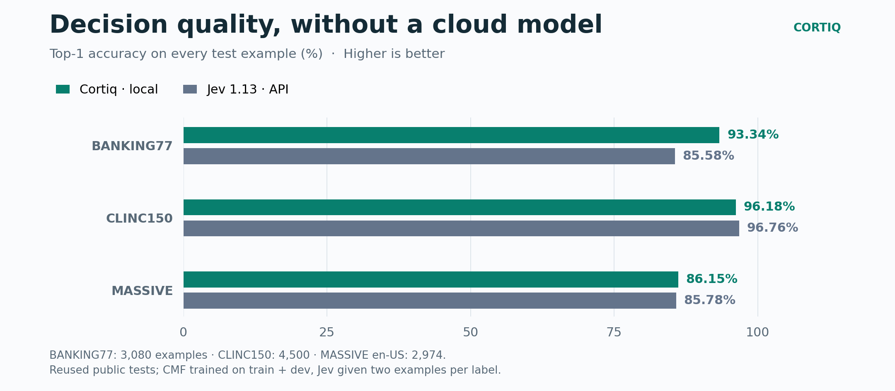
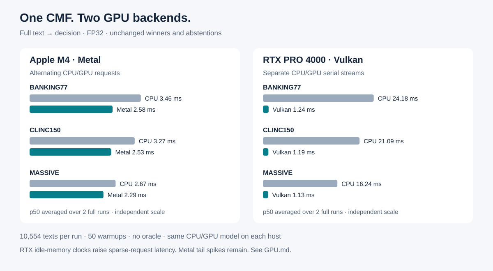
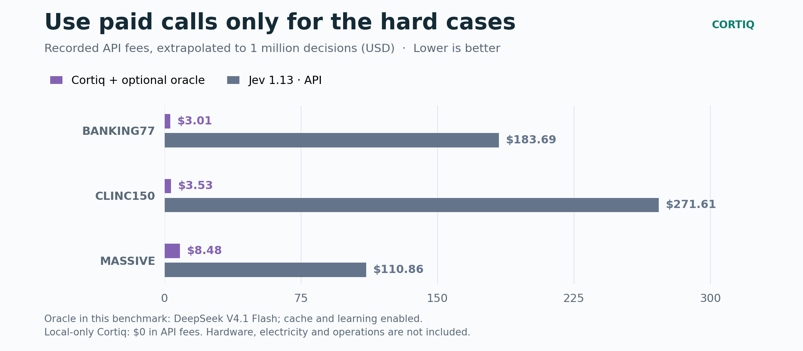

# CMF Decision

### Decisions in milliseconds. One portable CMF file.

Turn a customer message into a clear action: route a request, classify an intent,
or choose a tool using your own trained skill. Cortiq selects a label or abstains
when uncertain — **without generating tokens locally**. Connect an optional
oracle for unfamiliar cases, then use its answers to grow your local skills.

**Local decisions · Custom skills · Optional oracle**

**[Try the live Space →](https://huggingface.co/spaces/infosave/cmf-decision)** —
enter a request and inspect the decision, confidence and reconstruction errors.
No installation or API key needed.

[Quick start](#quick-start) · [Jev-compatible requests](#jev-compatible-request-format) · [Your own skill](#add-your-own-skill) · [Oracle](ORACLE.md#connect-openrouter) · [API](API.md) · [Benchmarks](BENCHMARKS.md) · [На русском](README_RU.md)

## Quick start

### Use the hosted service

Prefer an API without local setup? [allaigate Routing API](https://api.allaigate.com/)
is a ready-to-use routing service built on the CMF format. Get an API key on the
site and follow the [integration guide](https://api.allaigate.com/en/docs) —
no model download or server deployment required.

### Run locally

Install the latest published CLI from crates.io (requires Rust 1.88 or newer):

```bash
cargo install cortiq-cli --locked
```

Run the same command again to update. Download the model and make your first decision:

```bash
curl -fL -o cortiq-decision.cmf \
  https://huggingface.co/infosave/cmf-decision/resolve/main/cortiq-decision.cmf
cortiq decide cortiq-decision.cmf --skill banking77 -p "I still have not received my new card"
```

**Result:** `card_arrival`, answered locally. No cloud key required.
Included skills: `banking77`, `clinc150`, `massive`.


### Choose your hardware

CPU works without configuration. The same installed CLI also includes GPU support
(from Cortiq 0.8.0):

```bash
# Apple Silicon
CORTIQ_DECISION_DEVICE=metal cortiq decide cortiq-decision.cmf \
  --skill banking77 -p "I still have not received my new card"

# Vulkan GPU (a hardware Vulkan driver is required)
CORTIQ_DECISION_DEVICE=vulkan cortiq decide cortiq-decision.cmf \
  --skill banking77 -p "I still have not received my new card"
```

On multi-GPU hosts, also set `CORTIQ_DECISION_VULKAN_ADAPTER` to a unique part
of the GPU name. The same variables work with `cortiq serve`. [GPU guide →](GPU.md)

### Jev-compatible request format

Cortiq 0.8.5 adds an **opt-in** adapter for the TypeSafe System One request
format. Start it alongside the normal Cortiq APIs:

```bash
cortiq serve cortiq-decision.cmf --jev-compatible --port 8080
```

Point a System One client at `http://127.0.0.1:8080/v1/systemone`. Its default
`jev-latest` (and the historical `typesafe/jev-1.13`) is accepted **only as a
request alias**; an omitted model works too. Every response identifies the
local CMF model as `cmf-decision-0.8.5` — this adapter does not serve or claim
to be Jev. `GET /v1/models` supplies the matching System One discovery shape
when the flag is enabled. [Request and response details →](API.md#3a-system-one-request-adapter-jev-compatible)

From 0.8.6 a question whose options no skill was trained on is learned from the
oracle's answers into an *auto-skill* and then answered locally in milliseconds;
labels the oracle rarely picks stay quarantined and keep teaching.
[How auto-skills learn →](ORACLE.md#auto-skills)

## Measured results

### Quality: the model alone vs Jev 1.13



With abstention enabled, accepted answers are **97.24–98.70% correct**;
the model answers **54.30–92.11%** of requests locally, depending on the task.
[Accuracy and coverage together →](BENCHMARKS.md#accuracy-and-coverage)

### Laya: 77 choices on the same Mac


**Trained CMF skill: 93.34%, 3.10 ms p50.**
Laya's base English checkpoint, all 77 label names at once: 35.65%,
917.59 ms p50. All 3,080 rows, both local, no oracle.
**A 77-option stress test, not Laya's best achievable result:** shortlisting and
multilingual were not tested, and training conditions differ.
[Full protocol, failed long-rubric run and raw results →](LAYA.md)

### Speed: now on Metal and Vulkan



**1.10–1.24 ms on RTX PRO 4000; 2.28–2.58 ms on Apple M4.**
The full path is accelerated, not just the reconstruction kernel. All **10,554**
test examples keep their CPU decisions and abstentions. No retraining.

M4 uses alternating CPU/GPU requests; RTX uses a warmed continuous stream.
Sparse RTX traffic is slower; Metal can have worse tails under desktop load.
[Protocol, tail latency and memory →](GPU.md) · [Earlier API comparison with Jev →](BENCHMARKS.md)

### Cost: cloud only when needed



Local-only decisions incur **$0 in API fees**. The optional hybrid run used
DeepSeek V4.1 Flash for hard cases, reaching **93.93% / 97.47% / 88.00%** overall
accuracy. Fees are extrapolated from recorded runs, not a hosting quote.
[Oracle setup →](ORACLE.md)

## Why CMF?

- **One deployable file.** Encoder, skills and decision rules travel together.
- **Resonance, not text generation.** Each label tries to reconstruct the input
  signal; the smallest error wins. A calibrated gate decides whether to answer.
- **Your tasks, your control.** Add skills from examples; keep existing skill
  parameters unchanged. Version and roll back learned updates.
- **Local by default.** Enable an external oracle only when you need one.

## Add your own skill

Prepare labeled examples in `train.jsonl` and describe the labels in `question.json`:

```bash
cortiq decision add-skill cortiq-decision.cmf --skill support \
  --train train.jsonl --question question.json -o support.cmf
cortiq decide support.cmf --skill support -p "Please cancel my subscription"
```

[Example data, calibration and training options →](API.md#7-your-own-model)

To serve over HTTP: `cortiq serve cortiq-decision.cmf`.
[Requests, keys and router compatibility →](API.md)

---

**Benchmark scope:** reused public datasets; CMF trained on train + dev,
Jev given two examples per label. The model combines a Cortiq NVG-modified text encoder with
trained resonance topologies. [Method, data and licenses](BENCHMARKS.md) ·
[Chart data](evidence/comparison.json)

Resonance Routing — US 19/452,440.
