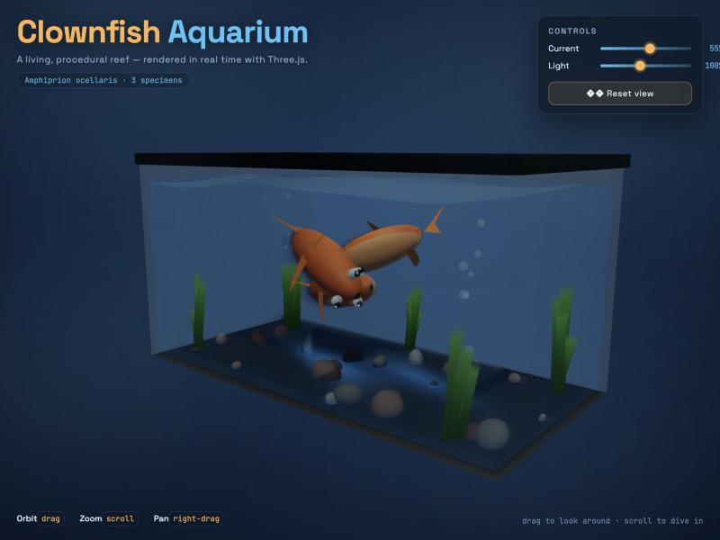

# Qwen3.8-Flash-Next — CMF

[Qwen3.8-Flash-Next](https://huggingface.co/Qwen/Qwen3.8-Flash-Next) (125B hybrid MoE with 6B active per token: 36 Gated DeltaNet + 12 sparse-attention layers, 512 experts per layer, a 51B n-gram embedding table, 262k context, thinking mode) packaged as [CMF](https://github.com/infosave2007/cmf) files, text model only. It runs with `cortiq`, a Rust inference engine with no Python and no ML framework; the tokenizer, the chat template and a hash per tensor are inside the file. The file is memory-mapped and experts stream from it as each token needs them, so the 77 GB model decodes on a GPU with 12–24 GB of VRAM.

Since cortiq 0.8.7 the whole token runs on the GPU (Vulkan through wgpu). With cortiq 0.8.8 an RTX 5090 decodes 81.7 tok/s at the full card and 108.6 tok/s with speculative decoding; an RTX 4090 on 0.8.7 did 41.9. cortiq 0.6.3–0.8.6 run the same file on the much slower host path; older versions cannot run it. An optional sidecar adds speculative decoding and an optional profile warms the GPU's expert cache; both are small downloads from this repository.

Three terms used below. An **expert** is one of the 512 small feed-forward blocks in each layer; a token uses 10 of them plus one shared expert. The **skeleton** is everything that runs for every token (hyper-connection mixers, GDN, QSA and PLE projections, routers, output head); on the GPU path it is resident on the card and takes 4.57 GB. The **arena** is the VRAM pool that holds as many experts as the remaining budget allows. The 51B n-gram table (PLE) stays memory-mapped; only the 16 rows a token needs are read.

[English](#quick-start) · [Русский](#кратко-по-русски)

## Quick start

```bash
cargo install cortiq-cli --locked        # 0.8.8 or later, or a prebuilt binary
hf download infosave/Qwen3.8-Flash-Next-cmf qwen38-flash-next-q2tp.cmf --local-dir .
hf download infosave/Qwen3.8-Flash-Next-cmf qwen38-flash-next-q2tp.mtp.cmf --local-dir .
hf download infosave/Qwen3.8-Flash-Next-cmf flashnext.profile --local-dir .
CMF_QWEN_PROFILE=flashnext.profile cortiq run qwen38-flash-next-q2tp.cmf --prompt "Explain quicksort in three sentences." --no-think --greedy
```

For the 4-bit file take `qwen38-flash-next-q4tp.cmf`, `qwen38-flash-next-q4tp.mtp.cmf` and `flashnext-q4tp.profile` instead (cortiq 0.8.9 or later; see Which file).

Use cortiq 0.8.8 or later (0.8.7 runs the GPU path at about 60 % of the speed); prebuilt binaries for Linux, macOS and Windows are on the [releases page](https://github.com/infosave2007/cmf/releases). The engine picks the GPU and its VRAM budget itself. `--no-think` asks for a direct answer; without it the model reasons first, so raise `--max-tokens` (default 256). `--greedy` enables speculative decoding with the sidecar; sampled runs decode one token at a time. The sidecar and the profile are optional: without them everything still runs, without speculative decoding and with a cold expert cache for the first tokens. The sidecar takes about 0.9 GB of VRAM whenever it sits beside the model, sampled runs included; for sampled chat set `CMF_QWEN_MTP=0`. The first run compiles the GPU pipelines and is slower; later runs reuse the cache. For chat, keep the model loaded with `cortiq serve` (see OpenAI-compatible server): each `cortiq run` loads the model and fills the expert cache again, about 10–30 s before the first token.

If `cortiq gpu` lists no adapter on headless Linux, install `libglvnd0 libgl1 libegl1 libvulkan1 vulkan-tools` ([`tools/runpod_vulkan_setup.sh`](https://github.com/infosave2007/cmf/blob/master/tools/runpod_vulkan_setup.sh) does that and probes the adapter) and export `XDG_RUNTIME_DIR=/tmp` in the shell for every `run`, `bench` and `serve`: without it Vulkan can fail to load and the engine silently falls back to the CPU.

## Which file

| you have | take | measured |
|---|---|---|
| a Vulkan GPU (NVIDIA, AMD, Intel) with 16 GB of VRAM or more and 77 GB of RAM or more | `qwen38-flash-next-q2tp.cmf` + sidecar + profile | RTX 5090: 81.7 tok/s, 108.6 with speculative decoding; RTX 4090: 41.9 (0.8.7). The 12/16 GB rows below were measured as `CMF_GPU_VRAM_MB` caps on a larger card; a real 16 GB card gets a default budget of about 13.5 GiB. AMD and Intel not measured |
| a 12 GB card | `qwen38-flash-next-q2tp.cmf`, sidecar off (`CMF_QWEN_MTP=0`) | the default budget is about 9.5 GiB, below the smallest measured cap; the GPU path starts if the skeleton and reserve fit, speed not measured |
| the same GPU, less RAM than the file | `qwen38-flash-next-q2tp.cmf` | runs; experts the cache lacks are read from disk, which slows the 12–16 GB budgets (see Performance) |
| you want the better quality and have 97 GB of RAM or more | `qwen38-flash-next-q4tp.cmf` + `qwen38-flash-next-q4tp.mtp.cmf` + `flashnext-q4tp.profile` | RTX 5090, cortiq 0.8.9: 40.3 tok/s, 44.4 with speculative decoding (bench). Each expert is 2.6 MB instead of 1.75, so VRAM holds about a third fewer; with less RAM than the 97 GB file it slows down a lot (11–20 tok/s on realistic prompts with 62 GB) |
| CPU only | `qwen38-flash-next-q2tp.cmf` with `CMF_GPU=0` | 3.6 tok/s on an AMD EPYC 7702 (cortiq 0.8.5) |
| Apple silicon, DX12 | either file | not measured; see Limits |

## Files

| file | contents | size | recommended for |
|---|---|---:|---|
| `qwen38-flash-next-q2tp.cmf` | experts: 2-bit gate/up, 4-bit down; skeleton and vocabulary 8-bit | 76.95 GB | **default**: the file measured on the GPU path |
| `qwen38-flash-next-q4tp.cmf` | experts 4-bit; skeleton and vocabulary 8-bit | 97.12 GB | better quality (code perplexity 4.11 against 4.76), slower; see Which file |
| `qwen38-flash-next-q2tp.mtp.cmf` | the model's multi-token-prediction head, quantized like the q2tp file | 1.08 GB | speculative decoding with the q2tp file; optional |
| `qwen38-flash-next-q4tp.mtp.cmf` | the same head quantized like the q4tp file | 1.50 GB | speculative decoding with the q4tp file; optional |
| `flashnext.profile` | routing profile: hit counts per (layer, expert) recorded with the q2tp file on English chat prompts; not weights | 98 KB | warm start of the expert arena; optional, does not change the output |
| `flashnext-q4tp.profile` | the same, recorded with the q4tp file (its routing differs slightly) | 98 KB | warm start with the q4tp file |

SHA-256 (the Hugging Face LFS object id is the same digest):

```text
e84cb832124bf4df8b6c9b3e5daa1e8b0caa47187a240f3b45d72173fce9935b  qwen38-flash-next-q2tp.cmf
601474afd6c7144dcfaf8e084cb2d2e786e06b4aeee3f20310ee0cae07224dfd  qwen38-flash-next-q4tp.cmf
a9cc9760d57db47d7365efcb21bdc13bdfc910947f3a547832d1945f0b56350a  qwen38-flash-next-q2tp.mtp.cmf
3a2c2fd90c8cfe309ef236418147a838663f3de0c13637a47428823f032d67f8  qwen38-flash-next-q4tp.mtp.cmf
```

Both model files are quantized directly from the bf16 checkpoint. Perplexity (`cortiq ppl`, 1,536 tokens, cortiq 0.8.9 on the GPU path):

| text | q2tp | q4tp |
|---|---:|---:|
| Rust source (`crates/cortiq-engine/src/expert_store.rs`) | 4.763 | **4.111** |
| *Alice's Adventures in Wonderland*, chapter I on | 1.138 | **1.097** |

The book is in the training data (perplexity near 1), so the code row is the informative one. Against the CPU reference on single-token checks the q4tp logits reach cosine 0.994–0.996, q2tp 0.986–0.989. The sidecar must sit next to the main file as `<main file without .cmf>.mtp.cmf`; the runtime finds it by that name. The profile is passed by path (`CMF_QWEN_PROFILE`).

## Requirements

| | `q2tp` | `q4tp` |
|---|---|---|
| disk | 77 GB, plus 1.08 GB sidecar and 98 KB profile | 97 GB |
| host RAM | at least the file size: the file is memory-mapped and every expert the GPU cache lacks is read from it | at least the file size |
| GPU path (cortiq ≥ 0.8.7) | a wgpu adapter with binding arrays (Vulkan); measured on an RTX 5090 (0.8.8) and an RTX 4090 (0.8.7), at budgets from 12 GB to the full card | same path accepts the file; not measured |
| host path (fallback) | its GPU expert cache needs a 14 GB budget; below that the MoE runs on the CPU | GPU expert cache off unless `CMF_QWEN_DYNAMIC_MOE=1` |
| CPU only (`CMF_GPU=0`) | works; the CPU-only build is `cargo install cortiq-cli --locked --no-default-features` | works; not measured |

With less host RAM than the file the model still runs, but every expert the GPU cache misses becomes a disk read; the 12 GB and 16 GB rows below were measured on such a host. DX12 and Metal are not measured; on macOS the native Metal backend has no GPU token path for this architecture and the model runs the host path.

## Performance

### RTX 5090, cortiq 0.8.8

Conditions: RTX 5090 (32 GB, driver 610.57, Vulkan through wgpu), AMD EPYC 9554 host, `qwen38-flash-next-q2tp.cmf`, arena pre-filled from `flashnext.profile`, one stream, 3 October 2026. The host was a container with a 62 GB memory limit and an overlay disk, so the 77 GB file was never fully cached; experts the arena misses come from the page cache or the disk.

`cortiq bench --tokens 120 --core` (greedy) after a 41-token prompt, steady decode, tok/s:

| VRAM budget | decode | decode with speculative MTP | prompt processing |
|---|---:|---:|---:|
| full card (auto budget 27.9 GiB) | **81.7** | **108.6** | 88–95 |
| 16 GB (`CMF_GPU_VRAM_MB=16000`) | 50.5 | 48.6 | 48 |
| 12 GB (`CMF_GPU_VRAM_MB=12000`) | 31.4 | 31.1 | 36 |

Over 300 tokens the full-card decode averages 65.8. Without the routing profile the full card starts cold and averages 56.5 over the 120 tokens. The bench prompt is part of the profile's history, so these are best-case numbers; realistic prompts below.

Realistic prompts through `cortiq serve` (one server, seven requests one after another, 170–180 tokens each, greedy, no thinking): a story, a Python function, an explainer for teenagers, a history of Saint Petersburg in Russian, an SQL schema, then the story and the function again. Decode tok/s, lowest–highest over the seven:

| VRAM budget | plain | with speculative MTP |
|---|---:|---:|
| full card | 47–63 | 54–65 |
| 16 GB | 32–46 | 32–40 |
| 12 GB | 28–38 | — |

Where the 0.8.8 gain over 0.8.7 comes from on this card (same bench, plain decode): 49.0 tok/s on 0.8.7 → 64.5 from host-side changes and trusted shader modules (no indirect-call validation outside DX12, frames finished ahead of the fence, uploads in the frame's submit, a 14 % larger arena) → 81.7 with the new hyper-connection kernels. A single-token pass now takes 10.4 ms of GPU time.

Long code, one request: the [3D aquarium example](examples/3d-aquarium/README.md) — a 2,151-token prompt, a 10,930-token answer (a working single-file Three.js page) at 67.8 tok/s with speculative decoding.



The same prompt with the q4tp file gave an 8,166-token answer at 33.4 tok/s whose scene is closer to the brief (bright orange fish with white, black-edged bands), but one variable name slipped (`userData.pect` read where `userData.pects` was stored), so the page stops at its loading screen until those four characters are fixed. Both outputs are in the example folder.

### RTX 5090, q4tp file, cortiq 0.8.9

Same card and host as above; `qwen38-flash-next-q4tp.cmf` with `flashnext-q4tp.profile` (the 12 GB row with `flashnext.profile`), `cortiq bench --tokens 120 --core --ignore-eos` (greedy; without `--ignore-eos` this file's answer to the bench prompt ends after one token), tok/s:

| VRAM budget | decode | decode with speculative MTP |
|---|---:|---:|
| full card (9,376 expert slots) | 40.3 | 44.4 |
| 16 GB | 27.5 | — |
| 12 GB | 23.2 | — |

A single-token pass takes 13.6–15.0 ms of GPU time (q2tp: 10.4). 0.8.9 runs the q4tp experts on four-row kernels as well (0.8.8: one-row, 17.4–18.9 ms). The rest of each token here is reading 46–53 missing experts of 2.6 MB from a 97 GB file through a 62 GB container: realistic prompts through `cortiq serve` run at 11–20 tok/s on this host. With RAM for the whole file those reads become memory copies.

### RTX 4090, cortiq 0.8.7

Conditions for every 0.8.7 number: RTX 4090 (24 GB, driver 580.159.04, Vulkan through wgpu), AMD EPYC 7702 host, `qwen38-flash-next-q2tp.cmf`, `cortiq bench --tokens 120 --core` (greedy) after a 41-token prompt, steady decode, one stream, arena pre-filled from `flashnext.profile`, 3 October 2026. That profile was recorded on prompts that include the bench prompt, which is the likely reason the bench runs faster than the realistic prompts below. "Decode" is one token per frame without speculation; the MTP column had the sidecar active. The host was a container with a 62 GB memory limit, so the 77 GB file was never fully cached and the 12 GB and 16 GB rows are bound by disk reads, not by the card.

| VRAM budget | decode | decode with speculative MTP | prompt processing |
|---|---:|---:|---:|
| 21.5 GB (full card, auto budget) | **41.9** | 41.4 | 47.9 |
| 16 GB (`CMF_GPU_VRAM_MB=16000`) | 27.2 | 26.6 | 25.4 |
| 12 GB (`CMF_GPU_VRAM_MB=12000`) | 16.3 | 15.2 | 19.2 |

Budgets are the `CMF_GPU_VRAM_MB` values (MiB): "16 GB" is 16,000 MiB ≈ 15.6 GiB, "12 GB" is 12,000 MiB ≈ 11.7 GiB; "21.5 GB" is the auto budget the engine chose on the 24 GB card.

All tok/s. Over 300 tokens the full-card decode averages 33.9: as the text moves away from the prompt the arena misses more often. The MTP column accepted 67 % of its drafts on the bench prompt. With the file in the page cache this host reached 24.4 tok/s at 12 GB on the earlier kernels (35.1 at the full card then, 41.9 now); the drop to 16.3 is disk, not the runtime. A host whose RAM holds the file was not measured.

Realistic prompts, 200 tokens, greedy, `cortiq run`, tok/s:

| prompt | VRAM budget | plain | with MTP | draft acceptance |
|---|---|---:|---:|---:|
| story (lighthouse keeper) | 21.5 GB | 28.5 | 26.2 | 34 % |
| story | 12 GB | 16.8 | 11.6 | 34 % |
| Python function (ISO 8601 parser) | 21.5 GB | 25.0 | 29.4 | 69 % |
| Python function | 16 GB | — | 20.8 | 69 % |
| Python function | 12 GB | — | 14.7 | 69 % |

What the budget buys, after the 4.57 GB of always-active weights:

| VRAM budget | resident experts (of 24,576) | cold experts per token | admission cost per token |
|---|---:|---:|---:|
| 21.5 GB | 8,304 (34 %) | 11 | 3–4 ms |
| 16 GB | 5,080 (21 %) | 47 | 12 ms |
| 12 GB | 2,680 (11 %) | 150 | 35 ms |

Earlier releases, host path, for scale only (not re-measured since):

| cortiq | hardware | file | mode | tok/s |
|---|---|---|---|---:|
| 0.8.5 | RTX 4090, 22.5 GB budget, same host | q2tp | host path with GPU expert cache | 2.7 |
| 0.6.3 | RTX 5090, 16 GB budget (host CPU not recorded) | q2tp | host path with GPU expert cache | 7.13 |
| 0.6.3 | RTX 5090, 16 GB budget (host CPU not recorded) | q4tp | host path, CPU/GPU auto plan | 4.71 |

## How it runs on the GPU

On the device path (0.8.7 and later) the whole token stays on the card: the skeleton, the GDN recurrent state, the QSA key/value and indexer caches and the PLE history are resident, and routing runs on the GPU. Per layer the host receives only the list of routed experts the arena lacks and one hidden vector; those cold experts are copied from the memory-mapped file, admitted to the arena at once and computed on the card in the next frame. A frame carries up to eight tokens, so a prompt is processed in chunks of eight and speculative decoding verifies its drafts in one frame. Internals: [docs/QWEN38_FLASH_NEXT_DEVICE.ru.md](https://github.com/infosave2007/cmf/blob/master/docs/QWEN38_FLASH_NEXT_DEVICE.ru.md) (Russian).

**Path selection.** A wgpu adapter with binding arrays (Vulkan) takes the GPU path at any budget that holds the skeleton and the cache reserve (measured down to 12 GB). Otherwise the host path runs the skeleton on the CPU and keeps a GPU expert cache only for `q2tp` at a budget of 14 GB or more (`CMF_QWEN_DYNAMIC_MOE=auto`). `CMF_GPU=0` forces the CPU; `CMF_QWEN_DEVICE=0` keeps the host path, which remains the reference implementation. If the GPU path turns itself off inside a run (past ~16k positions, see Long context), that request finishes on the host path without the earlier context.

### Where the experts live

Three tiers, fastest first:

| tier | what | sized by |
|---|---|---|
| VRAM arena | the hottest routed experts, 1.75 MB each, computed in place | what the VRAM budget holds after the 4.57 GB skeleton and a 768 MiB reserve: 13,808 of the 24,576 experts on a 32 GB card (13,224 with the MTP bank), 2,680 at 12 GB |
| RAM | the rest of the file, through the memory map and the OS page cache | free RAM; container limits apply |
| disk | whatever the page cache does not hold | — |

A routed expert the arena lacks is copied into it straight from the mapping (one copy, no intermediate buffer) and computed on the card in the next frame. The 28 GB n-gram table is read row by row with random-access advice, so a row that is not cached costs one page from the disk, not a 128 KiB read-around. On the test host the OS page cache beat an explicit RAM tier: it already held most of the file, and a tier filled with direct reads competes with it for the same memory. The explicit tier and direct I/O are opt-in for hosts where they measure better (`CMF_QWEN_RAM_TIER_MB`, `CMF_QWEN_IO`, see Knobs). With VRAM + RAM larger than the file, the disk goes quiet once the working set is read.

The budget decides how many experts each token finds missing, and that decides the speed:

| VRAM budget (RTX 5090) | resident experts | missing per token (bench, steady) | admission per token |
|---|---:|---:|---:|
| full card | 13,808 | 11 | 2–3 ms |
| 16 GB | 5,080 | 48 | 6–7 ms |
| 12 GB | 2,680 | 150 | 14–15 ms |

### Routing profile

`flashnext.profile` counts how often each (layer, expert) pair was routed to (48 × 512 counters; 8,163 experts seen). With `CMF_QWEN_PROFILE=flashnext.profile` the arena is filled hottest-first before the first token instead of learning the working set during the first tokens; at the full budget all 8,163 fit. The output does not change. To record your own, run with `CMF_QWEN_PROFILE_SAVE=my.profile` (written every 32 tokens; a loaded profile is extended, otherwise a fresh one starts). Recording works on the GPU path only.

### Speculative decoding (MTP sidecar)

The checkpoint ships a multi-token-prediction head: one hybrid layer (sparse attention plus its own 512 experts) with its own mixer, 31 tensors, 5.2 GB in bf16. cortiq converts it into `qwen38-flash-next-q2tp.mtp.cmf` (1.08 GB) and loads it by name from the main file's directory.

Each round the head drafts k = 3 tokens (`CMF_QWEN_MTP_K`, 1–7); the main model verifies them together with the last accepted token in one frame of k + 1 positions, keeps the longest accepted prefix and rolls the recurrent state back by snapshot. The text equals plain greedy decoding except at floating-point near-ties: the window sums in a different order than a one-token frame, so a near-tie can flip and the two texts go apart from there (identical over 80 tokens for k = 2–7; a 6,000-token code answer went apart after about 140 tokens). It runs only under greedy decoding (`--greedy`, or `temperature: 0` in an API request) and only on the GPU path; sampled runs do not speculate. The head and a VRAM bank for its 512 experts (about 0.9 GB) are loaded whenever the sidecar sits beside the model, before the main arena is sized, so sampled runs pay that VRAM too. `CMF_QWEN_MTP=0` turns it off and frees the VRAM. On the RTX 5090 with 0.8.8 it pays at the full card: bench 81.7 → 108.6 tok/s (acceptance ~67 %), realistic prompts 47–63 → 54–65, long code ~78 % acceptance. k = 3 is the best setting there (k = 2: 93.9, 4: 86.1, 5: 82.3 tok/s on the bench). At 16 and 12 GB it is level with plain decoding on the bench (48.6 vs 50.5, 31.1 vs 31.4) and no faster on realistic prompts: the window gathers more missing experts per round, which eats what it saves. On the RTX 4090 with 0.8.7 it was about level at the full card and slower on free text.

To build the sidecar yourself (not needed to use it): the tool reads the shard headers with HTTP range requests and downloads only the MTP byte ranges, not the ~50 GB of shards that hold them.

```bash
python tools/qwen4_mtp_fetch.py --out ./mtp-src
cortiq convert --model ./mtp-src --quant q2tp --output qwen38-flash-next-q2tp.cmf --mtp-sidecar   # writes qwen38-flash-next-q2tp.mtp.cmf; the main file is not read or rewritten
```

## Usage

```bash
cortiq run qwen38-flash-next-q2tp.cmf                                   # interactive chat, thinking on
cortiq run qwen38-flash-next-q2tp.cmf --prompt "..."                    # one answer, thinking first
cortiq run qwen38-flash-next-q2tp.cmf --prompt "..." --no-think         # direct answer
cortiq run qwen38-flash-next-q2tp.cmf --prompt "..." --greedy           # deterministic; speculative decoding on
```

### Sampling

Qwen's recommended settings; the model thinks by default, `--no-think` selects instruct mode:

| mode | temperature | top_p | top_k | min_p | presence_penalty | repetition_penalty |
|---|---:|---:|---:|---:|---:|---:|
| thinking | 1.0 | 0.95 | 20 | 0.0 | 0.0 | 1.0 |
| instruct (`--no-think`) | 0.7 | 0.80 | 20 | 0.0 | 1.5 | 1.0 |

```bash
cortiq run qwen38-flash-next-q2tp.cmf --prompt "..." --temperature 1.0 --top-p 0.95 --top-k 20 --min-p 0.0 --presence-penalty 0.0 --rep-penalty 1.0
cortiq run qwen38-flash-next-q2tp.cmf --prompt "..." --no-think --temperature 0.7 --top-p 0.80 --top-k 20 --min-p 0.0 --presence-penalty 1.5 --rep-penalty 1.0
```

Without flags the CLI samples at temperature 0.7 with repetition penalty 1.1 and stops after 256 new tokens. `--greedy` means temperature 0 (`--temperature` and `--rep-penalty` cannot be combined with it) and is the only mode with speculative decoding.

### OpenAI-compatible server

```bash
CMF_QWEN_PROFILE=flashnext.profile cortiq serve qwen38-flash-next-q2tp.cmf --host 127.0.0.1 --port 8080

curl http://127.0.0.1:8080/v1/chat/completions -H "Content-Type: application/json" \
  -d '{"model": "qwen38-flash-next-q2tp", "messages": [{"role": "user", "content": "Hi!"}], "temperature": 0, "enable_thinking": false}'
```

| route | purpose |
|---|---|
| `POST /v1/chat/completions` | OpenAI shape: `messages`, `temperature`, `top_p`, `seed`, `repetition_penalty`, `presence_penalty`, `max_tokens` (default 256), `stream` (SSE, ends with `data: [DONE]`), `enable_thinking` (or `chat_template_kwargs.enable_thinking`), `tools` / `tool_choice` |
| `POST /v1/completions` | `prompt`, `temperature`, `repetition_penalty`, `presence_penalty`, `max_tokens` |
| `GET /v1/models` | one entry, id `qwen4_exp-cortiq` |
| `GET /healthz` | liveness plus capabilities (`tools` is true when the chat template has a tools branch) |
| `GET /v1/cortiq/status`, `GET /v1/cortiq/masks`, `POST /v1/cortiq/switch` | runtime status, slot memory and GPU counters; task masks |
| `GET /`, `GET /dashboard` | web dashboard |

Without `--host` the server binds `0.0.0.0`; `127.0.0.1` keeps it local. `temperature: 0` is greedy and therefore the only setting under which the sidecar speculates. Requests are served by a pool of pipeline slots (`CMF_SERVE_SLOTS`, default cores / 4, clamped to 1–4); the GPU path with more than one slot was not measured.

### Long context

Upstream context is 262,144 tokens. The GPU path serves positions up to about 16k (4,096 indexer blocks × 4). Past that it switches itself off (one warning in the log) and the request continues on the host path, whose state was never filled for this sequence: the rest of that request is generated without the earlier context. For prompts or conversations beyond ~16k tokens start with `CMF_QWEN_DEVICE=0` (host path, slow) from the first token. On the GPU path the K/V and indexer caches live in VRAM inside the `CMF_QWEN_KV_RESERVE_MB` reserve (768 MiB by default, enough for the whole ~16k range).

## Knobs

| variable | default | path | when to touch it |
|---|---|---|---|
| `CMF_GPU` | wgpu on Linux/Windows, native Metal on macOS | both | `0` = CPU only; `wgpu` forces wgpu (also on macOS, where this model's GPU kernels need it; unmeasured) |
| `CMF_GPU_ADAPTER` | first ranked adapter | both | index from `cortiq gpu` or a case-insensitive name substring |
| `CMF_GPU_VRAM_MB` | card total minus a 2.5–4 GiB reserve (Vulkan); 8 GiB on DX12 | both | cap the weight budget (the 16 GB and 12 GB rows above) |
| `CMF_QWEN_DEVICE` | on | GPU | `0` = host path (reference, slow) |
| `CMF_QWEN_KV_RESERVE_MB` | 768 | GPU | VRAM kept out of the arena for K/V and frame scratch; sized for the GPU path's full ~16k range; lower for more resident experts |
| `CMF_QWEN_PREFILL_CHUNK` | 8 | GPU | tokens per prompt frame, 1–8 |
| `CMF_QWEN_PROFILE` | unset | GPU | path of a routing profile to pre-fill the arena |
| `CMF_QWEN_PROFILE_SAVE` | unset | GPU | path to record one; written every 32 tokens |
| `CMF_QWEN_MTP` | on when the sidecar exists | GPU | `0` = no speculative decoding and no VRAM for the head |
| `CMF_QWEN_MTP_K` | 3 | GPU | drafts per round, 1–7 |
| `CMF_MMAP_POPULATE` | unset | both | `1` faults the whole file in at open, for hosts whose RAM holds it |
| `CMF_QWEN_DYNAMIC_MOE` | auto | host | host-path GPU expert cache: auto = q2tp and a budget ≥ 14 GB; `1` forces, `0` disables; no effect on the GPU path |
| `CMF_QWEN_POOL_PCT` | 75 | host | host-path arena request, 25–85 % of the budget; ignored on the GPU path (as is `CMF_QWEN_EXPERT_SLOTS`) |
| `CMF_QWEN_HC_V3` | on (devices with 32-wide subgroups) | GPU | `0` = the 0.8.7 hyper-connection kernels |
| `CMF_QWEN_EXPERT4` | on | GPU | `0` = one-row expert kernels (q2tp and, since 0.8.9, q4tp use four-row ones) |
| `CMF_QWEN_CHECKED` | unset | GPU | `1` = shader runtime checks and workgroup zero-init back on (slower; for debugging) |
| `CMF_QWEN_IO` | `mmap` | GPU | how a missing expert is read: copied from the memory map; `pread` = one buffered read; `direct` = page cache if resident, else O_DIRECT (Linux) |
| `CMF_QWEN_RAM_TIER_MB` | unset (off) | GPU | explicit RAM tier: `auto` = free RAM minus a reserve, or a size in MiB; drops copies of arena experts first, reloads evicted ones in the background |
| `CMF_QWEN_CACHE_HINTS` | unset | GPU | `1` = release an expert's file pages once it is in VRAM, read it back ahead when evicted (Linux) |
| `CMF_QWEN_WILLNEED` | unset | GPU | `1` = read-ahead advice before each copy (helps a cold disk, costs on cached pages) |
| `CMF_QWEN_STORE` | on | GPU | `0` = the 0.8.7 read path |
| `CMF_QWEN_WORKSPACE_MB` | 0 at ≥ 24 GiB budgets, else 2–4 GiB | GPU | VRAM kept out of the arena besides the K/V reserve |
| `WGPU_VALIDATION_INDIRECT_CALL` | off (on for DX12) | GPU | `1` = wgpu validates every indirect dispatch again |
| `CMF_QWEN_PROF` | unset | GPU | `1` prints the arena capacity at start and one line per token (frame time split into encode/finish/spin/post/PLE, cold experts, admissions, read counters) |
| `CMF_QWEN_DEVICE_CHECK` | unset | GPU | `1` runs the host path alongside single-token frames and prints logit cosine and argmax; set `CMF_QWEN_PREFILL_CHUNK=1` with it |

`CMF_QWEN_STAGE_MB` (256 MB pinned upload staging per buffer; 0 = plain queue writes) and `CMF_MMAP_POPULATE=1` did not change the numbers on the test host; `CMF_QWEN_FETCH_MAX` / `CMF_QWEN_FETCH_MIN_SEEN` (16 / 1 on the GPU path) are tuning knobs that were not tested there.

## Quantization profile

| tensor group | `q2tp` file | `q4tp` file |
|---|---|---|
| expert `gate_proj` / `up_proj` (routed and shared) | q2tp | q4tp |
| expert `down_proj` | q4tp | q4tp |
| PLE n-gram table (128 shards) | q4tp | q4tp |
| GDN and QSA projections, PLE key/value projections, embeddings, output head | q8_2f | q8_2f |
| routers, norms, hyper-connection gates, GDN `in_proj_a/b` and convolutions | f16 | f16 |

The q2tp file holds 49,248 q2tp, 24,752 q4tp, 172 q8_2f and 751 f16 tensors; the q4tp file 74,000 q4tp, 172 q8_2f and 751 f16. The sidecar follows the same policy, with its `fc_embedding` / `fc_hidden` input projections in q8_2f. What the suffixes cost in general: [FORMATS.md](https://huggingface.co/infosave/cmf/blob/main/FORMATS.md).

## What is implemented, accuracy and limits

- **Accuracy.** `cortiq verify` checks all 74,923 per-tensor hashes of a model file. GPU against the CPU reference: layer intermediates at cosine 0.9998–0.99999 and identical argmax on single-token checks (logit cosine 0.98–0.985); over 160 positions with the 0.8.7 defaults (`CMF_QWEN_DEVICE_CHECK=1`), cosine 0.996–0.9995 with identical argmax at every position (`CMF_QWEN_DEVICE_CHECK=1 CMF_QWEN_PREFILL_CHUNK=1` repeats the comparison on any prompt; the check compares single-token frames only). The card accumulates in f32 and the host in f64, so a long greedy run can diverge from the host reference after about 40 tokens. Speculative output equals plain greedy decoding except at floating-point near-ties (see Speculative decoding). The 0.8.8 hyper-connection kernels match the 0.8.7 ones to about 1e-7 on the RTX 5090, and greedy text is byte-identical between them. Perplexity and task benchmarks were not measured.
- The full Qwen3.8-Flash-Next text architecture runs natively (`qwen4_exp`): four-stream gated residual, 36 Gated DeltaNet and 12 Qwen Sparse Attention layers with the block indexer (4 query heads, 1 shared key, 2048-token budget), 512-expert MoE with top-10 routing plus the shared expert, bigram/trigram PLE lookup, partial RoPE (64 of 256 dimensions). The vision tower is omitted: the upstream repository is image-text-to-text, this one is text-generation. The MTP head ships as the optional sidecar above.
- GPU path: measured on two cards (RTX 5090 and RTX 4090, Vulkan, NVIDIA), the `q2tp` file on both and the `q4tp` file on the RTX 5090; DX12 and Metal-via-wgpu are not excluded by the code and not measured.
- Apple silicon: the native Metal backend has no GPU token path for this architecture; the model runs the host path there. No Mac measurement exists.
- `cortiq info` does not list the sidecar; it is detected by name at run time. Several concurrent `cortiq serve` slots on the GPU path were not measured.

## Verify the download

```bash
sha256sum qwen38-flash-next-q2tp.cmf qwen38-flash-next-q2tp.mtp.cmf   # compare with the digests under Files
cortiq verify qwen38-flash-next-q2tp.cmf                             # per-tensor hashes
cortiq info qwen38-flash-next-q2tp.cmf                               # architecture, dtypes, tensor count
```

## License and attribution

Weights derive from the Qwen team's release and remain under the [Qwen Community License 1.0](https://huggingface.co/Qwen/Qwen3.8-Flash-Next/blob/main/LICENSE). The CMF format and the `cortiq` runtime are Apache-2.0: source at [github.com/infosave2007/cmf](https://github.com/infosave2007/cmf), format front page and model index at [infosave/cmf](https://huggingface.co/infosave/cmf), the quantization ladder at [FORMATS.md](https://huggingface.co/infosave/cmf/blob/main/FORMATS.md).

---

## Кратко по-русски

Это текстовая часть [Qwen3.8-Flash-Next](https://huggingface.co/Qwen/Qwen3.8-Flash-Next) (125B, 6B активных на токен, 512 экспертов на слой, n-gram-таблица 51B) в формате [CMF](https://github.com/infosave2007/cmf): два основных файла (`qwen38-flash-next-q2tp.cmf`, 76,95 ГБ, эксперты 2/4 бита — выбор по умолчанию; `qwen38-flash-next-q4tp.cmf`, 97,12 ГБ, эксперты 4 бита, на GPU-пути 0.8.7 не измерялся, MTP-файла для него нет), необязательный файл `qwen38-flash-next-q2tp.mtp.cmf` (1,08 ГБ, спекулятивное декодирование, лежит рядом с основным файлом) и профиль маршрутизации `flashnext.profile` (98 КБ, прогрев кэша экспертов, на ответ не влияет). Токенизатор и шаблон чата внутри файла; контрольные суммы SHA-256 приведены в разделе Files выше. Башня зрения не включена.

Нужен cortiq 0.8.8 или новее (`cargo install cortiq-cli --locked` или готовый бинарник со [страницы релизов](https://github.com/infosave2007/cmf/releases)); 0.8.7 работает на видеокарте примерно на 60 % этой скорости, версии 0.6.3–0.8.6 — на гораздо более медленном хост-пути. Требования: место на диске под файл, оперативная память не меньше размера файла (файл отображается в память, недостающие в кэше эксперты читаются из него), видеокарта с Vulkan и бюджетом от 12 ГБ (измерено на RTX 5090 и RTX 4090 ограничением 12, 16 ГБ и без ограничения; у настоящей карты на 16 ГБ движок берёт около 13,5 ГиБ, на 12 ГБ — около 9,5 ГиБ, это не измерялось); на безголовом Linux нужны `libglvnd0 libgl1 libegl1 libvulkan1 vulkan-tools` и `XDG_RUNTIME_DIR=/tmp` при каждом запуске, иначе движок молча уходит на процессор; без видеокарты работает на процессоре (`CMF_GPU=0`, 3,6 ток/с на AMD EPYC 7702, cortiq 0.8.5).

```bash
hf download infosave/Qwen3.8-Flash-Next-cmf qwen38-flash-next-q2tp.cmf --local-dir .
hf download infosave/Qwen3.8-Flash-Next-cmf qwen38-flash-next-q2tp.mtp.cmf --local-dir .
hf download infosave/Qwen3.8-Flash-Next-cmf flashnext.profile --local-dir .
CMF_QWEN_PROFILE=flashnext.profile cortiq run qwen38-flash-next-q2tp.cmf --prompt "Объясни квиксорт в трёх предложениях." --no-think --greedy
```

Скорость (один поток, `cortiq bench --tokens 120 --core`, файл q2tp, профиль маршрутизации): RTX 5090 32 ГБ, cortiq 0.8.8 — 81,7 ток/с на всей карте, 108,6 со спекулятивным декодированием, обработка промпта 88–95 ток/с, 50,5 при `CMF_GPU_VRAM_MB=16000`, 31,4 при 12 ГБ; RTX 4090 24 ГБ, cortiq 0.8.7 — 41,9 / 27,2 / 16,3. На реальных запросах через `cortiq serve` (рассказ, код, объяснение, текст на русском, SQL) RTX 5090 даёт 47–63 ток/с и 54–65 со спекулятивным декодированием. Пример длинного кода — [3D-аквариум](examples/3d-aquarium/README.md): ответ на 10 930 токенов, рабочая HTML-страница на Three.js, 67,8 ток/с.

Файл q4tp (эксперты 4 бита, 97 ГБ) качественнее: перплексия на коде 4,11 против 4,76 у q2tp, совпадение с эталоном на CPU 0,994–0,996 против 0,986–0,989. Для него есть свой MTP-файл `qwen38-flash-next-q4tp.mtp.cmf` (1,50 ГБ) и профиль `flashnext-q4tp.profile`. На RTX 5090 с cortiq 0.8.9 — 40,3 ток/с, 44,4 со спекулятивным декодированием; эксперт весит 2,6 МБ вместо 1,75, в видеопамять их помещается примерно на треть меньше, и без оперативной памяти под весь файл (97 ГБ) он заметно медленнее: 11–20 ток/с на реальных запросах при 62 ГБ.

Где лежат эксперты: самые горячие — в видеопамяти (на карте 32 ГБ — 13 808 из 24 576), недостающие движок копирует прямо из отображения файла, кэш страниц ОС служит вторым уровнем, диск — третьим. Если видеопамять и оперативная память вместе больше файла, после прогрева диск не читается. Явный RAM-кэш и прямое чтение с диска включаются переменными `CMF_QWEN_RAM_TIER_MB` и `CMF_QWEN_IO` — на тестовой машине кэш страниц ОС оказался быстрее, поэтому по умолчанию они выключены.

Спекулятивное декодирование работает только при жадном выводе (`--greedy` или `temperature: 0` в API) и только на пути через видеокарту; на RTX 5090 оно выгодно на всей карте (81,7 → 108,6 ток/с), а при 12–16 ГБ выигрыша не даёт; текст совпадает с обычным жадным выводом, кроме почти равных вариантов, где другой порядок суммирования может выбрать другой токен; MTP-файл рядом с моделью занимает около 0,9 ГБ VRAM и при сэмплировании, поэтому для обычного чата ставьте `CMF_QWEN_MTP=0`. `--no-think` даёт прямой ответ без блока рассуждений. Сервер: `CMF_QWEN_PROFILE=flashnext.profile cortiq serve qwen38-flash-next-q2tp.cmf --host 127.0.0.1 --port 8080`, маршруты `/v1/chat/completions`, `/v1/completions`, `/v1/models`, `/healthz`, `/v1/cortiq/status` и панель на `/`; без `--host` сервер слушает `0.0.0.0`; `temperature: 0` в запросе — единственный режим, в котором используется MTP-файл.

Ограничения: путь через видеокарту обслуживает около 16 тысяч позиций (4096 блоков индексатора по 4 токена); дальше он отключается, а хост-путь не получает накопленное состояние — остаток такого запроса генерируется без учёта предыдущего контекста. Для промптов длиннее ~16k токенов запускайте с `CMF_QWEN_DEVICE=0` с первого токена. `CMF_QWEN_KV_RESERVE_MB` (768 по умолчанию) покрывает весь диапазон GPU-пути; поднимать его не нужно, уменьшать можно ради дополнительных экспертов. `CMF_QWEN_DEVICE=0` принудительно включает хост-путь, `CMF_GPU_VRAM_MB` ограничивает видеопамять; Apple silicon и DX12 не измерялись. Веса остаются под [Qwen Community License 1.0](https://huggingface.co/Qwen/Qwen3.8-Flash-Next/blob/main/LICENSE); формат и движок — Apache-2.0.
