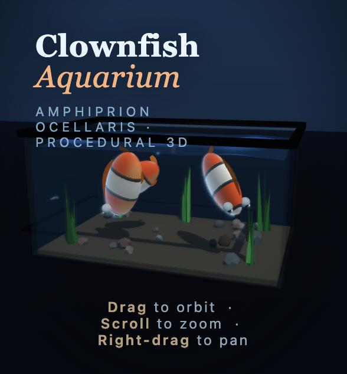

# Example: interactive 3D aquarium in one HTML file

A single generation by `qwen38-flash-next-q2tp.cmf` on one RTX 5090, kept as produced: the page was not edited.

| file | what it is |
|---|---|
| [`prompt.md`](prompt.md) | the prompt, sent as the user message unchanged (2,151 tokens with the chat template) |
| [`response.md`](response.md) | the model's full answer: the HTML in a code block, then its notes |
| [`aquarium.html`](aquarium.html) | the code block of the answer, saved as a file (762 lines, Three.js 0.160 from unpkg) |
| `screenshot.jpg`, `screenshot-orbit.jpg` | the page in a Chromium-based browser, default view and after orbiting |
| [`aquarium-q4tp.html`](aquarium-q4tp.html), `screenshot-q4tp.jpg` | the same prompt with `qwen38-flash-next-q4tp.cmf` (8,166 tokens, 33.4 tok/s) |

## How it was generated

```bash
CMF_QWEN_PROFILE=flashnext.profile cortiq run qwen38-flash-next-q2tp.cmf \
  --prompt "$(cat prompt.md)" --greedy --no-think --max-tokens 13000
```

cortiq 0.8.8, the MTP sidecar beside the model (speculative decoding, 3 drafts per round), the routing profile from this repository, the whole card as VRAM budget. RunPod: RTX 5090 32 GB, AMD EPYC 9554, Vulkan, a container with a 62 GB memory limit.

| | |
|---|---:|
| answer | 10,930 tokens, finished on its own (`stop`) |
| decode | 67.8 tok/s |
| first token (model load and the 2,151-token prompt included) | 27.9 s |
| whole run | about 3 minutes |

## What was checked

- The page loads with no console errors and renders: a glass tank with a dark rim, rippling water, three fish with eyes, fins and a wagging tail, swaying plants, a stone bed, rising bubbles, floor caustics and a control panel (current strength, light, reset view).
- Orbit, zoom and pan work.
- What falls short of the prompt: the fish's white bands are faint at the default exposure, and the bodies read more bronze than bright orange.

The model is quantized to 2 bits in its experts. Long code can come out with a slip: two other greedy runs of the same prompt through `cortiq serve` (with and without speculative decoding; the server formats the chat slightly differently, so its text differs) each produced a page with one JavaScript syntax error. Run the page or a linter before using generated code.

## With the q4tp file


